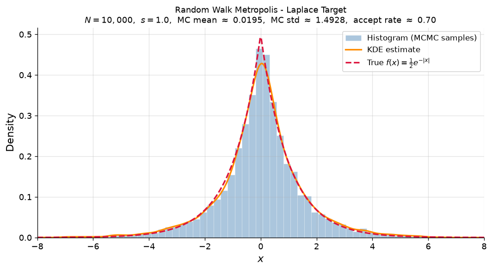
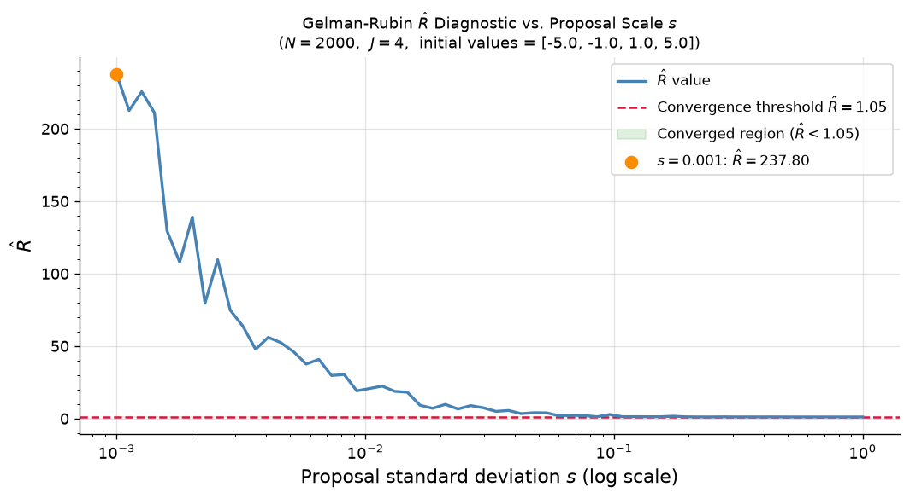
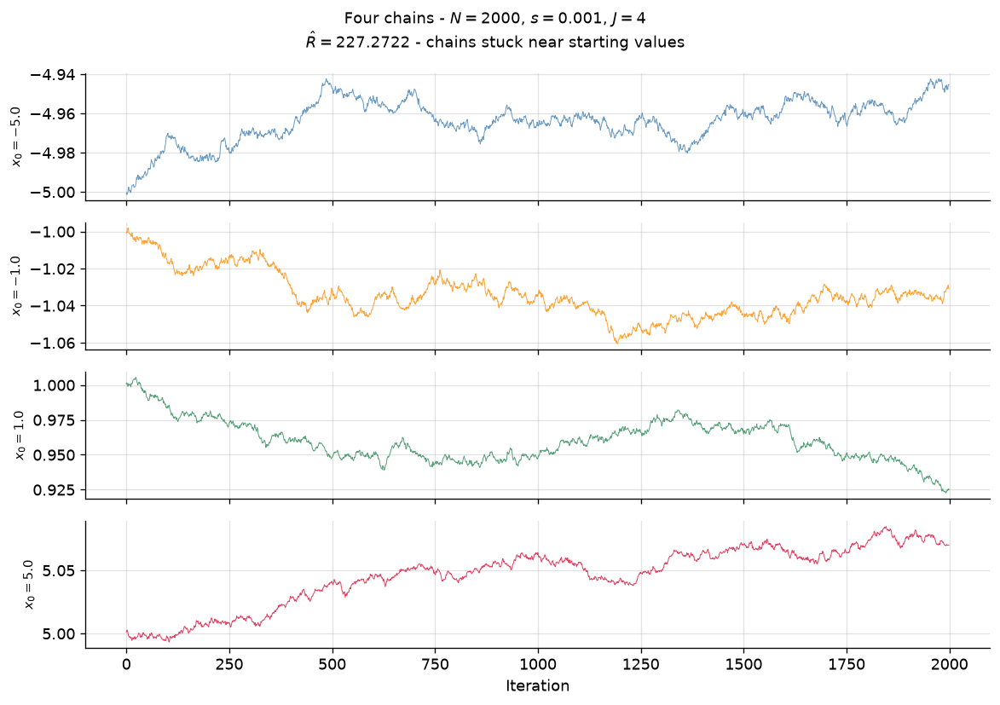
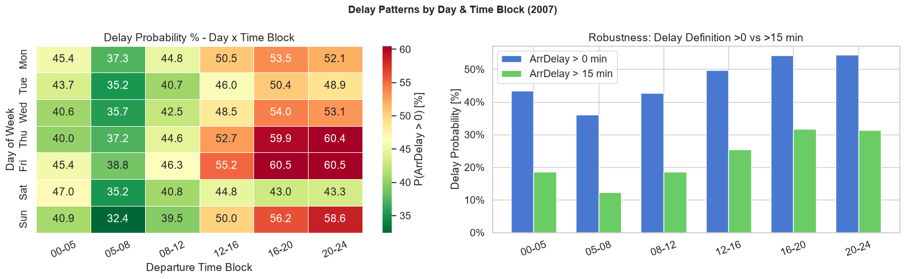
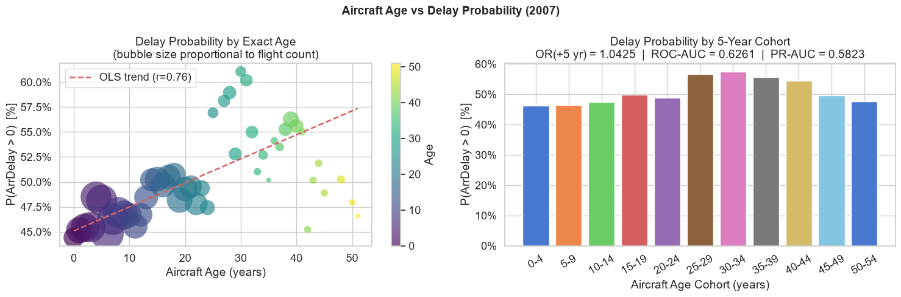
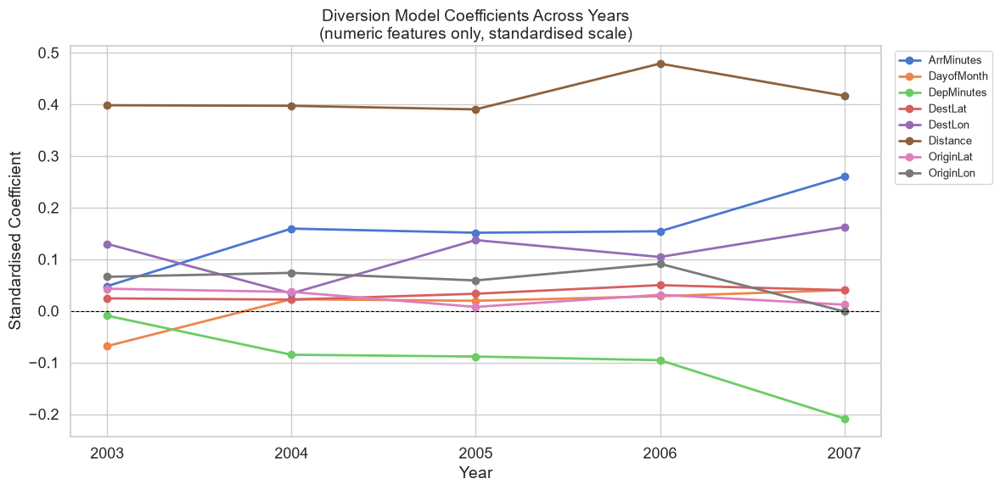

# MCMC from Scratch & US Flight Delays at Scale

Two statistical computing projects, each implemented twice (once in **Python** and once in **R**), to show the same methodology working across both ecosystems:

1. **Metropolis–Hastings MCMC**: a random walk Metropolis sampler built from scratch, with Gelman–Rubin ($\hat{R}$) convergence diagnostics.
2. **US flight delay analysis**: a memory-efficient pipeline over **~35 million flight records** (2003–2007) answering when to fly, whether aircraft age matters, and how well rare flight diversions can be predicted with logistic regression.

*This project began as university coursework and has since been revised and extended as a personal portfolio piece.*

---

## Part 1: Metropolis–Hastings MCMC

**The problem.** You often need samples from a distribution you can't sample directly; you only know a function proportional to its density. MCMC solves this by constructing a Markov chain whose long-run distribution is the target. This project implements the simplest such algorithm, **random walk Metropolis**, and uses the Laplace distribution $f(x) = \frac{1}{2}e^{-|x|}$ as a target where the true answer is known, so the sampler can be validated exactly.

**Methodology in plain language.** From the current position, propose a small random step. If the proposed point has higher density, move there; if lower, move with probability equal to the density ratio. Repeat thousands of times and the visited points behave like samples from the target. The catch: results are only valid if the chain has *converged*, and this is where the **Gelman–Rubin diagnostic** comes in: run several chains from dispersed starting points and compare within-chain to between-chain variance ($\hat{R} \approx 1$ means the chains agree; $\hat{R} \gg 1$ means they haven't mixed).

**Key findings.**

- With proposal scale $s = 1$, the sampler recovers the Laplace distribution almost exactly: MC mean ≈ 0.02 (true 0), MC std ≈ 1.49 (true $\sqrt{2} \approx 1.41$), acceptance rate ≈ 0.70.
- With $s = 0.001$ the chains barely move from their starting points and $\hat{R} \approx 227$, a textbook illustration of non-convergence.
- Sweeping $s$ across a log grid shows convergence ($\hat{R} < 1.05$) is reached once $s \gtrsim 0.1$, i.e. once the proposal scale approaches the same order as the target's standard deviation.

| Samples vs. true density | $\hat{R}$ vs. proposal scale |
| --- | --- |
|  |  |



---

## Part 2: US Flight Delay Analysis (2003–2007)

**The problem.** Using five years of US domestic flight records, answer three practical questions:

- **When is the best time to fly?** Delay probability is computed for all 42 day-of-week × departure-time-block combinations, per year, with a robustness check under a stricter (>15 min) delay definition.
- **Do older aircraft get delayed more?** Aircraft age is derived by joining tail numbers to manufacture years, then a logistic regression estimates the age effect while controlling for month, day of week, departure time, distance, carrier, and airport location.
- **Can diversions be predicted?** A logistic regression predicts P(Diverted) from schedule features. Diversions are rare (~0.2%), so **PR-AUC** against the naive baseline is the primary metric.

**Methodology in plain language.** Each year's CSV (~600 MB) is read in chunks with compact dtypes to keep memory bounded. Cleaning removes physically impossible air times, missing arrival delays, and invalid tail numbers (diverted rows are set aside and re-included for the diversion model). Feature engineering adds delay indicators, departure time blocks, aircraft age, and airport coordinates. Models are fit per year on stratified subsamples with held-out test sets, so every metric reported is out-of-sample.

**Key findings.**

- **Fly early, fly on weekends.** The early-morning block (05:00–08:00) has the lowest delay probability in every year, and the Sunday + early-morning combination is the overall winner (delay probability 25% in 2003 rising to 32% in 2007). Delays compound through the day, a knock-on effect of the hub-and-spoke system.
- **Aircraft age matters, but barely.** After adjustment, the odds ratio per +5 years of age is 1.01–1.04. Carrier operational performance dominates fleet age.
- **Diversions are partially predictable.** The model beats the naive baseline in every year (e.g. PR-AUC 0.159 vs 0.086 baseline in 2007; ROC-AUC ≈ 0.65–0.68) using schedule features alone, useful for risk-flagging, though weather data would be needed for deployable accuracy.



| Aircraft age vs delay | Diversion model stability |
| --- | --- |
|  |  |

---

## Tech stack

- **Python:** NumPy, SciPy, pandas, scikit-learn, Matplotlib, seaborn (Jupyter notebooks)
- **R:** data.table, tidyverse, ggplot2, patchwork, pROC, PRROC (R Markdown)
- **Data:** Harvard Dataverse, Data Expo 2009: Airline On-Time Data

## Repository structure

```
├── mcmc_metropolis_hastings.ipynb        # Part 1, Python implementation
├── mcmc_metropolis_hastings.Rmd          # Part 1, R implementation
├── flight_delay_analysis.ipynb           # Part 2, Python implementation
├── flight_delay_logistic_regression.Rmd  # Part 2, R implementation
├── images/                               # Output plots embedded above
├── requirements.txt                      # Python dependencies
└── data/                                 # Flight data (not committed, see below)
```

## Data

The flight data comes from the **[Data Expo 2009: Airline On-Time Data](https://doi.org/10.7910/DVN/HG7NV7)** dataset on the Harvard Dataverse (originally compiled by the American Statistical Association from US DOT records). It is far too large to commit (~3.3 GB uncompressed for 2003–2007), so download it separately:

1. From the [Dataverse page](https://doi.org/10.7910/DVN/HG7NV7), download `2003.csv.bz2` … `2007.csv.bz2` and decompress them.
2. Also download the three reference files: `plane-data.csv`, `airports.csv`, `carriers.csv`.
3. Place all eight files in a `data/` folder at the repository root:

```
data/
├── 2003.csv … 2007.csv
├── plane-data.csv
├── airports.csv
└── carriers.csv
```

Part 1 (MCMC) needs no data at all.

## How to run

**Python notebooks**

```bash
pip install -r requirements.txt
jupyter notebook mcmc_metropolis_hastings.ipynb   # runs in seconds
jupyter notebook flight_delay_analysis.ipynb      # full 5-year pipeline; expect a long run
```

**R Markdown documents**

Install the R packages, then knit:

```r
install.packages(c("data.table", "tidyverse", "scales", "patchwork", "viridis",
                   "RColorBrewer", "pROC", "PRROC", "knitr", "rmarkdown"))
rmarkdown::render("mcmc_metropolis_hastings.Rmd")
rmarkdown::render("flight_delay_logistic_regression.Rmd")
```

Both flight-delay implementations read from `./data` by default (`DATA_DIR` at the top of the pipeline section).
